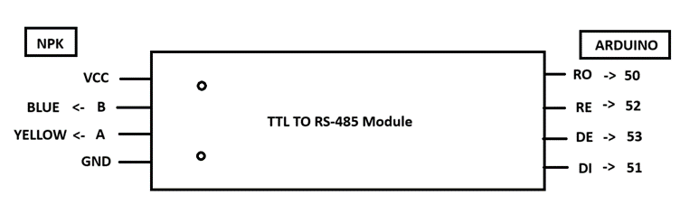

# Autonomous Geo-Exploration Rover
This project involves a teleoperated rover with caterpillar tracks, powered by Arduino MEGA, designed for agricultural land soil analysis and nutrient data visualization on a map. The rover uses LoRa technology for communication, GPS for navigation, and an FPV camera for real-time monitoring.


## Table of Contents
- [Components ](#components)
- [Block Diagram](#block-diagram)
- [Connections](#Connections)
- [Installation](#installation)
- [Usage](#usage)
- [Features](#features)
- [Contributing](#contributing)
- [Contact](#contact)


## Components
- 33GB520 DC Motor x2
- L293N Motor Driver x1
- NPK Sensor x1
- MAX485 to RS485 x1 
- GPS Module with Antenna x1
- LoRa Transmitter and Receiver x1
- LoRa Antenna x2
- Arduino Nano x1
- Arduino Mega x1
- FPV Camera x1
- Camera Receiver x1
- Linear Screw Drive Stepper Motor x1
- Stepper Motor Driver x1

## Block Diagram


## Connections


| DC Motor Driver | Arduino Mega | 
|--------------|--------------|
| Ena | 4 |
| In1 | 5 |
| In2 |	6|
| In3 |	7|
| In4 |	8|
| Enb |	9|

*DC Motor Driver to Arduino Mega*

|Stepper Motor	|Stepper Motor Driver|
|---------|-----------|
|Blue	| 1B|
|Black	| 1A|
|Yellow	| 2A|
|Red	| 2B|

*Stepper Motor to Stepper Motor Driver*


|Stepper Motor Driver|	Arduino Mega|
|----------|---------|
|Direction|	30|
|Step	|28|
|Enable|	48|

*Stepper Motor Driver to Arduino Mega*

|GPS	|Arduino Mega|
|-----|----------|
|RX	| 14 (TX3)|
|TX|	15 (RX3)|

*GPS to Arduino Mega*

|LoRa	|Arduino Mega|
|--------|----------|
|M0|	GND|
|M1|	GND|
|RX|	16 (TX2)|
|TX|	17 (RX2)|

*LoRa to Arduino Mega*



*NPK Sensor to RS-485 to Arduino MEGA*

## Installation
Required Libraries are as follows:

Arduino Packages
----
- AccelStepper.h
- SoftwareSerial.h
- TinyGPS++.h

Python Packages
----
Open cmd and execute the following command:
```bash
pip install -r requirements.txt
```

## Usage

Examples of how to use your project. For example:

For Running Demo open cmd:

```python
python main.py
```
It will ask for two options:
- Option 1 for Controling the Rover
- Option 2 for Chart Creation
<br/>
Note: Make sure the Excel is created

## Features

- Teleoperated rover with caterpillar tracks
- Arduino MEGA powered
- NPK Sensor for Soil Analysis
- Visualization on a map and Chart
- LoRa technology for long-range communication
- GPS for accurate navigation
- FPV camera for real-time monitoring

## Contributing

Contributions are welcome! Please follow these steps:

1. Fork the repository.
2. Create your feature branch (`git checkout -b feature/AmazingFeature`).
3. Commit your changes (`git commit -m 'Add some AmazingFeature'`).
4. Push to the branch (`git push origin feature/AmazingFeature`).
5. Open a pull request.


## Contact

Dinish S K - [dinishsk02@gmail.com](mailto:your.email@example.com)
